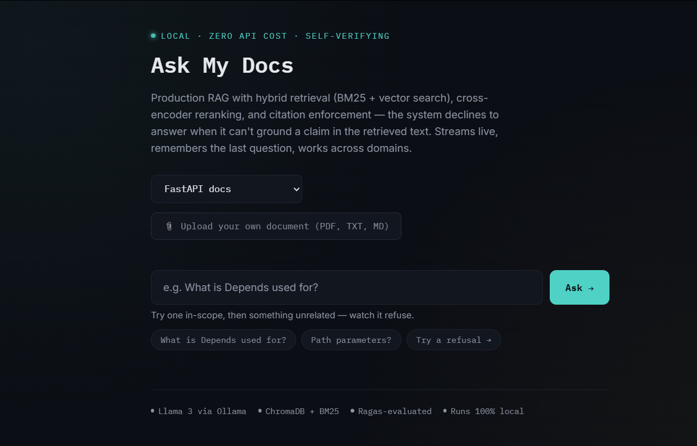
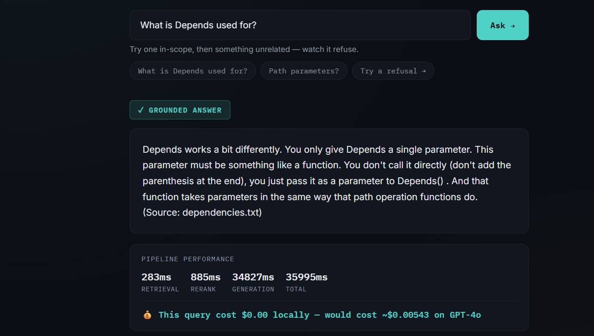
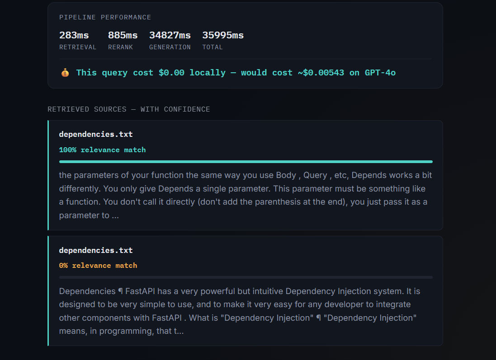
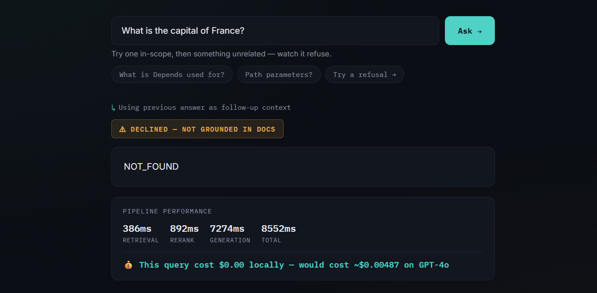
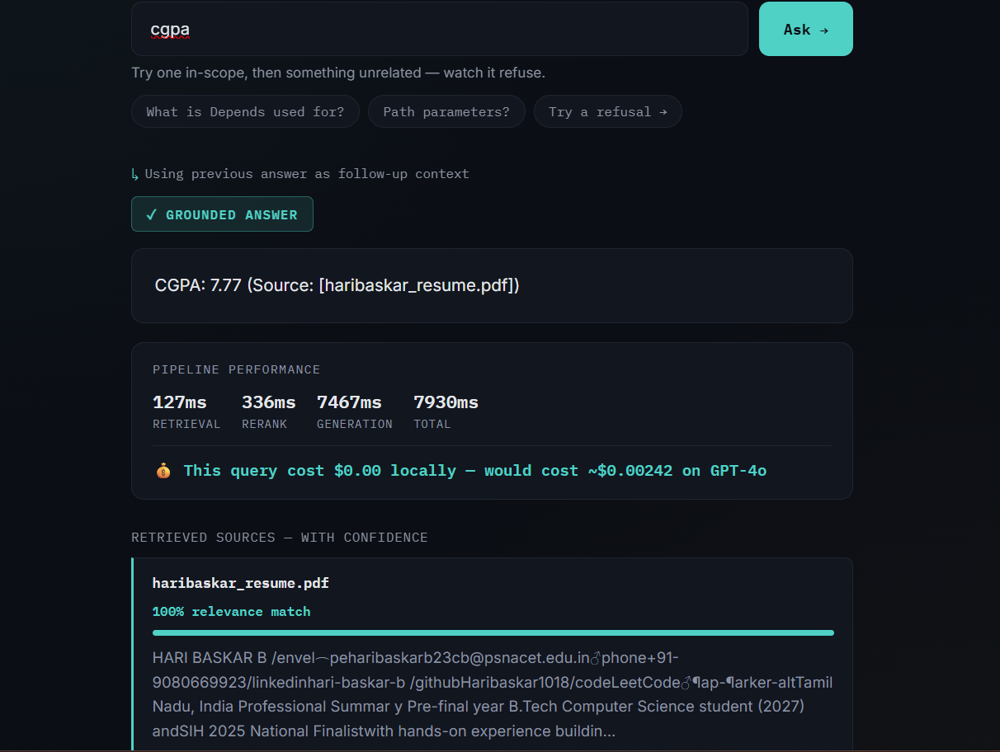

<div align="center">

# 🔍 Ask My Docs

**A production-grade RAG system that never guesses — it cites its sources, or it declines to answer.**

[](https://github.com/Haribaskar1018/Ask_my_docs/actions)

-4FD1C5)


[Demo](#demo) · [Highlights](#why-this-isnt-just-another-chat-with-your-pdf-demo) · [Architecture](#architecture) · [Results](#evaluation-results) · [Setup](#running-it-locally)

</div>

---

A production-grade Retrieval-Augmented Generation (RAG) system that answers questions using only real, retrieved documents — and explicitly refuses to answer when it can't ground a claim in the source text. Built entirely with open-source models, running 100% locally with zero API cost.

**In one sentence:** a search-and-answer tool that reads real documents and gives trustworthy, source-backed answers — and honestly admits when it doesn't know something, instead of guessing.

---

## 🎯 Why this isn't just another "chat with your PDF" demo

Most portfolio RAG projects stop at vector search + a chat bubble. This one is built the way a production system actually needs to be:

- **It measures itself.** A hand-verified golden dataset, scored with Ragas, wired into CI — not a vibes-based "looks right to me" demo.
- **It knows when to say no.** 100% refusal accuracy on out-of-scope questions, enforced through the prompt design, not just hoped for.
- **It shows its work.** Every answer is traceable to a specific retrieved chunk with a live confidence score — nothing is a black box.
- **It's honest about tradeoffs.** The README documents a real precision-vs-completeness experiment (prompt strictness and retrieval breadth tuning) with the actual before/after numbers, not just a single cherry-picked score.
- **It's a real tool, not a fixed demo.** Upload any PDF, TXT, or Markdown file and query it immediately — the pipeline isn't hardcoded to one dataset.
- **It runs for $0.** Every component — LLM, embeddings, reranker, evaluator — is open-source and local. No API keys, no per-query cost, no vendor lock-in.
- **It knows its own limits.** The "what I'd do with more time" section below isn't filler — it's a specific, honest list of the exact edges of what's been built (OCR gap, dataset size, judge-model bias), which is a stronger signal of engineering maturity than pretending it's finished.

---

## 🎬 Demo

[▶ Watch the 90-second demo](https://drive.google.com/file/d/1jbPm7f6hr9yFe2mazlwlfPlnaJdKbHKp/view?usp=drivesdk) — streaming answers, citation refusal, domain switching, and real-time document upload, all shown live.

### Screenshots

**Homepage — domain selector, upload button, and example question chips**


**A grounded answer, streamed live, with a source citation**


**Retrieved sources with per-chunk confidence scores — nothing is a black box**


**Citation enforcement in action — declining an out-of-scope question instead of guessing**


**Real-time upload — asking a question about a freshly uploaded PDF (a resume) seconds after upload**


---

## 🤔 Why this exists

Standard chatbots can hallucinate — they generate plausible-sounding text even when they don't actually know the answer. That's a real risk for anything where trust matters: technical documentation, legal text, internal knowledge bases, personal documents.

This project solves that by never letting the model answer from memory. Every response is grounded in retrieved text from your actual documents, with a source citation — and if the evidence isn't there, the system says so instead of bluffing.

---

## 🏗️ Architecture

```
Documents (web pages / PDF / TXT / MD)
        │
        ▼
    Chunking (500–800 tokens, 100-token overlap)
        │
   ┌────┴─────┐
   ▼          ▼
Vector       BM25
embedding    keyword
(ChromaDB)   index
   └────┬─────┘
        ▼
  Hybrid retrieval (merged candidates)
        │
        ▼
  Cross-encoder reranking (precision top-k)
        │
        ▼
  LLM + citation check — is this grounded?
        │
   ┌────┴─────┐
   ▼          ▼
Grounded    Declined
 answer     (NOT_FOUND)
```

Two parallel retrieval methods (exact keyword match + semantic meaning match) are combined so the system finds relevant context whether or not the user's wording matches the source text. A reranker then re-scores the merged candidates for precision before generation. A final citation check decides whether to answer at all.

---

## ✨ Features

- **Hybrid retrieval** — BM25 keyword search + vector semantic search, merged
- **Cross-encoder reranking** — a second, slower-but-more-accurate model re-scores retrieved chunks for precision
- **Citation enforcement** — the system explicitly refuses to answer (`NOT_FOUND`) when retrieved context doesn't support a claim, rather than guessing
- **Versioned prompts** — prompt templates live in `prompts.yaml`, not hardcoded in application code
- **Multi-domain support** — pre-indexed domains (FastAPI docs, Requests library docs, a resume) plus **real-time upload** of any PDF, TXT, or Markdown file, chunked and embedded on the spot
- **Streaming responses** — tokens stream live to the UI as they're generated
- **Multi-turn memory** — follow-up questions can reference the previous answer
- **Live observability dashboard** — per-query retrieval/rerank/generation latency (P-level timing), confidence score per retrieved source, and a cost comparison against what the same query would cost on a paid API (GPT-4o pricing) vs. its actual $0.00 local cost
- **Evaluation + CI** — a hand-verified golden dataset scored with Ragas (faithfulness, answer relevancy), with a GitHub Actions pipeline that validates configuration and evaluation thresholds on every push

Fully open-source stack — **Llama 3** (via Ollama), **ChromaDB**, **Sentence Transformers**, **rank_bm25** — no paid API dependency anywhere in the pipeline.

---

## 📊 Evaluation results

Measured on a 12-question hand-verified golden dataset (10 answerable, 2 deliberately out-of-scope):

| Metric | Score |
|---|---|
| Faithfulness (Ragas) | 0.717 |
| Answer relevancy (Ragas) | 0.475 |
| Refusal accuracy | 100% |

Faithfulness and relevancy were tuned through direct experimentation — comparing prompt strictness and retrieval breadth (top-k) configurations — documented as a real precision/completeness tradeoff rather than a single lucky number. Refusal accuracy (correctly declining out-of-scope questions) was 100% across every configuration tested.

**Honest caveat:** the golden dataset is currently 12 questions; production-grade evaluation typically uses 50–200. This is a known, acknowledged gap — the evaluation *framework* is real and CI-gated, but statistical confidence in the exact faithfulness number should be read with that sample size in mind.

---

## 🛠️ Tech stack

| Component | Tool | What it does here |
|---|---|---|
| **LLM** | Llama 3 (8B) via **Ollama** | Generates answers locally, no API cost. Ollama exposes an OpenAI-compatible endpoint, which is also how evaluation is wired up without a paid API key. |
| **Embeddings** | `all-MiniLM-L6-v2` (**Sentence Transformers**) | Converts text into vectors for semantic similarity search — the "meaning" half of hybrid retrieval. |
| **Vector store** | **ChromaDB** | Stores and queries chunk embeddings per domain, with a separate collection created dynamically for every uploaded document. |
| **Keyword search** | `rank_bm25` | Classic BM25 scoring — the "exact term match" half of hybrid retrieval, catches technical terms embeddings alone can miss. |
| **Reranker** | `cross-encoder/ms-marco-MiniLM-L-6-v2` | Re-scores the merged retrieval shortlist by jointly encoding (question, chunk) pairs — more accurate than embedding-distance alone, used only on the narrowed candidate set for speed. |
| **Evaluation** | **Ragas** (faithfulness, answer relevancy) | Scores generated answers against retrieved context using an LLM-as-judge pattern, run against the golden dataset. |
| **PDF parsing** | `pypdf` | Extracts text from uploaded PDFs for real-time ingestion. |
| **Backend** | **Flask** + `flask-cors` | Serves the retrieval/generation pipeline as a streaming NDJSON API and handles file uploads. |
| **Config** | `PyYAML` | Prompt templates are versioned in `prompts.yaml`, not hardcoded in application code. |
| **Frontend** | Vanilla **HTML / CSS / JavaScript** | No framework — a single dependency-free page consuming the streaming API directly via `fetch()` and the Streams API. |
| **CI/CD** | **GitHub Actions** | Validates configuration and evaluation thresholds on every push; fails the build if faithfulness regresses. |

**Fully open-source, self-hosted stack — no OpenAI, Anthropic, Cohere, or any paid API anywhere in the pipeline.**

---

## 🚀 Running it locally

1. Install [Ollama](https://ollama.com) and pull the model:
   ```bash
   ollama pull llama3
   ```
2. Create a virtual environment and install dependencies:
   ```bash
   python -m venv ragenv
   ragenv\Scripts\activate   # or source ragenv/bin/activate on Mac/Linux
   pip install chromadb sentence-transformers rank_bm25 flask flask-cors pypdf beautifulsoup4 requests pyyaml
   ```
3. Build the initial domains:
   ```bash
   python fetch_docs.py && python chunk_docs.py && python build_vectorstore.py
   ```
4. Start the backend:
   ```bash
   python server.py
   ```
5. Open `index.html` directly in a browser (not via a live-reload extension — the upload feature writes new files to disk, which can trigger unwanted auto-refreshes).

---

## 🔭 What I'd do with more time

- **OCR fallback for scanned PDFs** — the current PDF ingestion only extracts native text; a scanned/image-only PDF currently returns a clear error rather than a wrong answer, but adding `pytesseract`-based OCR would close this gap properly.
- **Expand the golden dataset to 50+ questions** for a statistically stronger faithfulness score.
- **Semantic chunking** instead of fixed word-count chunking, to avoid splitting ideas mid-thought regardless of overlap.
- **A stronger, separate judge model for evaluation** — currently the same local Llama 3 both answers and judges faithfulness, which risks some self-bias.
- **CI running full evaluation live**, not just config validation — currently CI validates thresholds against the last locally-run eval rather than executing Ollama/Llama 3 directly inside GitHub Actions, since GitHub's runners don't have the model available. A self-hosted runner or a lighter fallback model would close this gap.
- **Persist uploaded documents across sessions** — uploads are currently session-scoped in the UI (the vector data persists on disk, but the dropdown forgets it on refresh); this is a deliberate simplicity tradeoff, not a bug.

---

